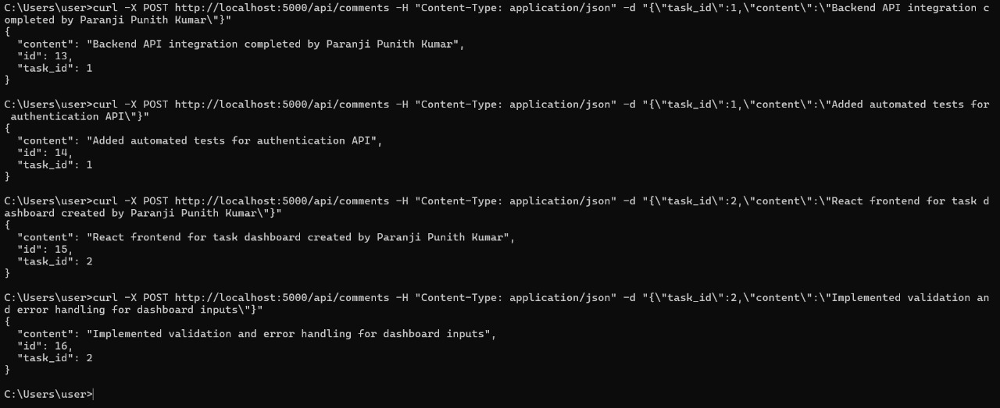
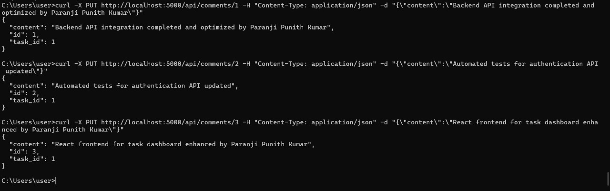
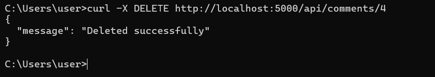

# Assignmentbetter

This project is a Python-based web application for managing comments, featuring CRUD operations (Create, Read, Update, Delete).

## Features
- RESTful API for comment management
- Modular structure with routes and services
- SQLite database integration

## Project Structure
```
app/
  __init__.py
  app.py
  config.py
  models.py
  routes/
    __init__.py
    comment_routes.py
  services/
    comment_service.py
  instance/
    app.db
```

## API Operations

Below are the main HTTP methods supported by the API:

### POST (Create)


### GET (Read)


### PUT (Update)


### DELETE (Delete)


## Running the Application
1. Run the app:
   ```bash
   python -m app.app
   ```

## Testing

Run tests using:
```bash
pytest tests/
```

---

Feel free to explore the code and contribute!
