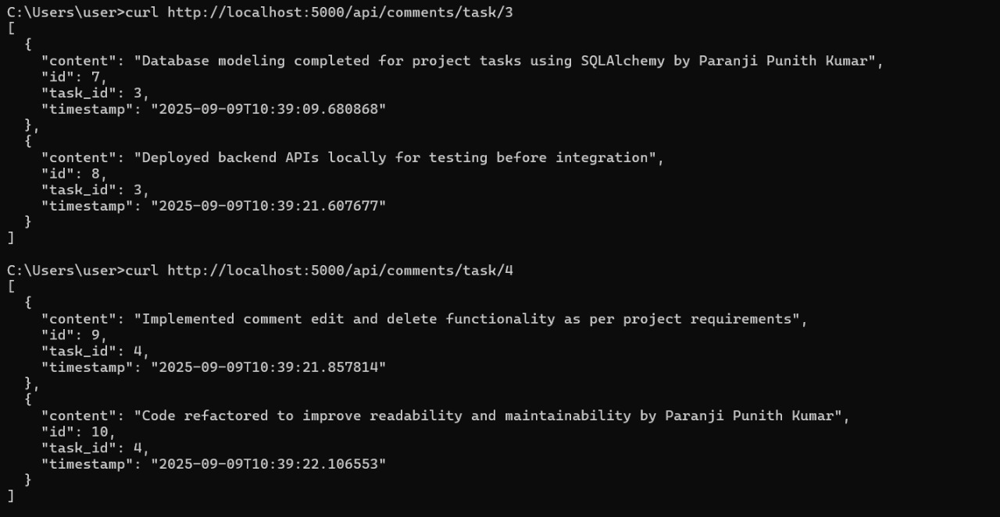

# Assignmentbetter

This project is a Python-based web application for managing comments, featuring CRUD operations (Create, Read, Update, Delete).

## Features
- RESTful API for comment management
- Modular structure with routes and services
- SQLite database integration

## Project Structure
```
better_assgn/
├── app/
│   ├── __init__.py
│   ├── app.py
│   ├── config.py
│   ├── models.py
│   ├── routes/
│   |   ├── __init__.py
│   |   ├── comment_routes.py
│   ├── services/
│   |   ├── comment_service.py
│   ├── instance/
│       └── app.db
├── tests/
│   └── test_comments.py
├── DELETE.jpeg
├── GET.jpeg
├── POST.jpeg
├── PUT.jpeg
└── README.md
```

## API Operations

Below are the main HTTP methods supported by the API:

### POST (Create)

``` 
curl -X POST http://localhost:5000/api/comments -H "Content-Type: application/json" -d "{\"task_id\":1,\"content\":\"Paranji Punith Kumar completed the backend API integration for user authentication\"}"
```
```
curl -X POST http://localhost:5000/api/comments -H "Content-Type: application/json" -d "{\"task_id\":1,\"content\":\"Code reviewed by Paranji Punith Kumar. 10 months of internship experience contributed to efficient implementation\"}"
```
```
curl -X POST http://localhost:5000/api/comments -H "Content-Type: application/json" -d "{\"task_id\":2,\"content\":\"Front-end React component created for task dashboard by Paranji Punith Kumar from IIIT Kottayam\"}"
```


### GET (Read)
```
curl http://localhost:5000/api/comments/task/1
```
```
curl http://localhost:5000/api/comments/task/2
```
```
curl http://localhost:5000/api/comments/task/3
```
```
curl http://localhost:5000/api/comments/task/4
```
```
curl http://localhost:5000/api/comments/task/5
```



### PUT (Update)

```
curl -X PUT http://localhost:5000/api/comments/1 -H "Content-Type: application/json" -d "{\"content\":\"Paranji Punith Kumar completed backend API integration for user authentication and login flow\"}"
```
```
curl -X PUT http://localhost:5000/api/comments/2 -H "Content-Type: application/json" -d "{\"content\":\"Code reviewed and optimized for performance by Paranji Punith Kumar, 10 months internship experience applied\"}"
```


### DELETE (Delete)
```
curl -X DELETE http://localhost:5000/api/comments/3
```
```
curl -X DELETE http://localhost:5000/api/comments/4
```


## Running the Application
1. Run the app:
   ```bash
   python -m app.app
   ```

## Testing

Run tests using:
```bash
pytest tests/
```

---

Feel free to explore the code and contribute!
